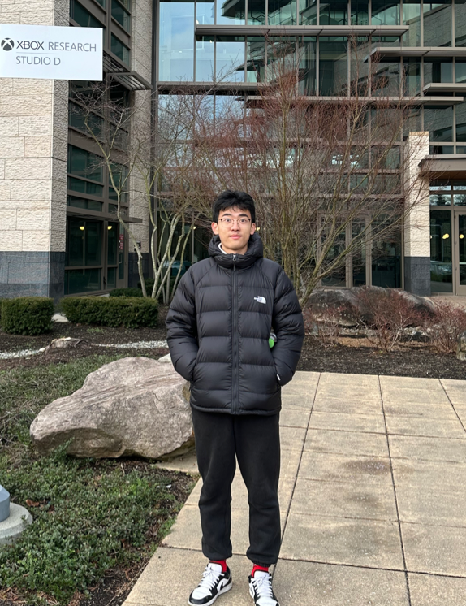

# Wentao Li

## Introduction

我是 **Wentao Li**，目前就读于 **UIUC** (University of Illinois at Urbana-Champaign) 的 Computer Engineering 大三学生。  
这是我使用 Docsify 搭建的个人网页，你可以在这里找到我的联系邮箱、简历、成绩单，以及我参与或负责过的项目。

**我的邮箱**:  
[wentaol5@illinois.edu](mailto:wentaol5@illinois.edu)

**我的文档**:  
- [下载我的 CV](downloads/Wentao_Li_Resume.pdf)  
- [下载我的成绩单](downloads/transcript.pdf)

---

**CE Undergrad Student @ UIUC**  
[wentaol5@illinois.edu](mailto:wentaol5@illinois.edu)

---

# My Projects

下面是我做过的四个项目示例展示（左图右文）：

### Project 1: [Project Title 1](https://linktoproject1.com)

简单的项目描述……

---

### Project 2: [Project Title 2](https://linktoproject2.com)

简单的项目描述……

<!-- ---

### Project 3: [Project Title 3](https://linktoproject3.com)

简单的项目描述……

---

### Project 4: [Project Title 4](https://linktoproject4.com)

简单的项目描述…… -->
