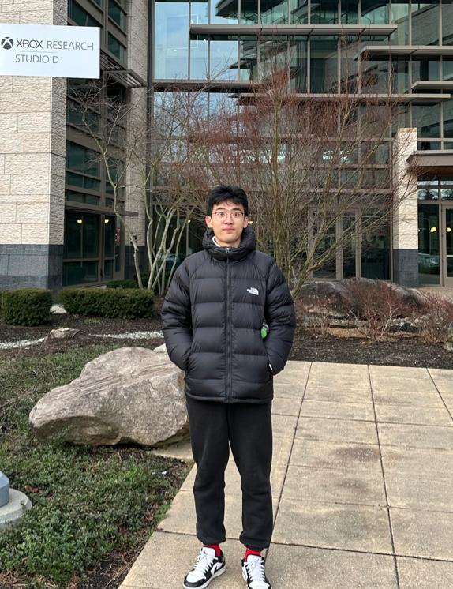
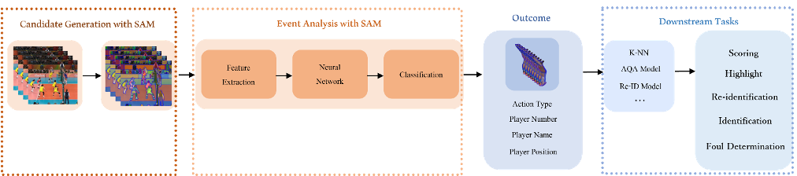
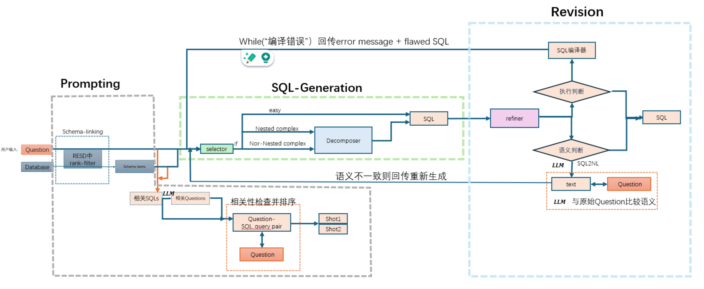

# Wentao Li (李文韬)
<!-- 整个容器：左右分栏 -->

  <!-- 左栏 -->
  

    
I am a junior Computer Engineering student at <a href="https://zjui.intl.zju.edu.cn/en/" target="_blank">ZJUI</a>. 
    

    
I'm interested in LLM applications, such as Agents and RAG, as well as natural language processing. I am also interested in software and game development.

    

      You can find my contact info, CV, and my personal projects below.  
      Feel free to reach out to me at <strong>wentaol5@illinois.edu</strong>.
    

  

  <!-- 右栏 (照片) -->
  

    
  

---

<!-- Project 1 -->

  <!-- Left side: Image (or video) -->
  

    
  

  <!-- Right side: Text -->
  

    <h3>Sports Videos Analysis Research</h3>
    
Undergraduate Research supervised by Prof. Gaoang Wang from ZJU. My fellows and I preprocessed different datasets according to the experimental requirements to realize the interoperability of dataset formats. We designed a new sports videos analysis system base on computer vision technique to recognize the action. We use MMaction2 framework to train models in an unsupervised way.     
    <a href="https://wentao677.github.io/downloads/Volleyball_paper.pdf" target="_blank">[Thesis #1]</a>   <a href="https://wentao677.github.io/downloads/SAM-paper.pdf" target="_blank">[Thesis #2]</a>   <a href="https://wentao677.github.io/downloads/Volleyball_Analyzing_System_poster.pdf" target="_blank">[Poster]</a> 
    

  

<!-- Project 2 -->

  

    
  

  

    <h3>Natural Language to SQL Research</h3>
    
Undergraduate Research supervised by Prof. Gang Chen from ZJU. My fellows and I designed a new pipeline with fine-tuning, prompting, SQL-generating and revision. The new pipeline reaches an accuracy of 52% on the benchmark. We used VLLM to deploy the LLM and applied the LangChain framework to train models. <a href="https://wentao677.github.io/downloads/sql.pdf" target="_blank">[Thesis]</a>   <a href="https://github.com/Wentao677/NL2SQL_Study" target="_blank">[Github]</a>

  

<!-- Project 3 (with video) -->

  

    <video width="270" autoplay muted loop controls>
      <source src="assets/warrior_short_demo.mp4" type="video/mp4">
      Your browser does not support the video tag.
    </video>
  

  

    <h3>"Warrior"</h3>
    
A third-person shooting game made in UE5 engine with my teammates as the final project in CS 415. <a href="https://github.com/Wentao677/Warrior" target="_blank">[Github]</a>    <a href="https://drive.google.com/file/d/1nhR25RMLn09DV9rfoe7B3D-qy4Wqjj9-/view" target="_blank">[Code]</a>

  

<!-- Project 4 (with video) -->

  

    <video width="170" autoplay muted loop controls>
      <source src="assets/App.MP4" type="video/mp4">
      Your browser does not support the video tag.
    </video>
  

  

    <h3>RoutiBlock</h3>
    
I developed a time management app. It has been released to ios App Store (U.S.).

  

