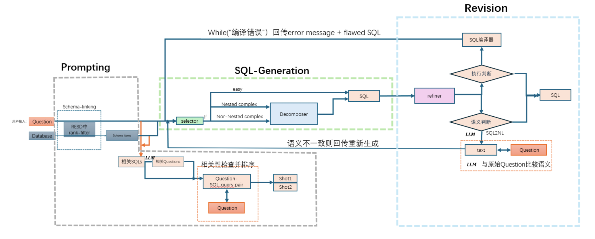

# Welcome to Wentao's Home Page!

Hi there! This is my personal homepage.

<!-- 整个容器：左右分栏 -->

  <!-- 左栏 -->
  

    
I'm Wentao Li (李文韬), a junior student in Computer Engineering at <strong>UIUC</strong>.

    
I'm interested in ... (这里可以写你对哪些方向感兴趣)。

    
    

      You can find my contact info, CV, transcript, and my personal projects below.  
      Feel free to reach out to me at <strong>wentaol5@illinois.edu</strong>.
    

  

  <!-- 右栏 (照片) -->
  

    
  

---

<!-- Project 1 -->

  <!-- Left side: Image (or video) -->
  

    
  

  <!-- Right side: Text -->
  

    <h3>Sports Videos Analysis Research</h3>
    
Undergraduate Researcher supervised by Prof. Gaoang Wang from ZJU. We preprocessed different datasets according to the experimental requirements to realize the interoperability of dataset formats. We Designed a new sports videos analysis system base on computer vision technique to recognize the action. We use MMaction2 framework to train models in an unsupervised way.
    Visit the project 
      <a href="https://wentao677.github.io" target="_blank">website</a> or download the related PDF 
      <a href="https://wentao677.github.io/downloads/SAM-paper.pdf" target="_blank">here</a> and
      <a href="https://wentao677.github.io/downloads/Volleyball_Analyzing_System_poster.pdf" target="_blank">here</a>
      .

  

<!-- Project 2 -->

  

    
  

  

    <h3>Natural Language to SQL Research</h3>
    
Undergraduate Researcher supervised by Prof. Gang Chen from ZJU. Designed a new pipeline with fine-tuning, prompting, SQL-generating and revision. The new pipeline reaches an accuracy of 66% on the benchmark. Used VLLM to deploy the LLM and applied the LangChain framework to train models.

  

<!-- Project 3 (with video) -->

  

    <video width="170" autoplay muted loop controls>
      <source src="assets/App.MP4" type="video/mp4">
      Your browser does not support the video tag.
    </video>
  

  

    <h3>RoutiBlock</h3>
    
I developed a time management app. It has been released to Apple App Store (U.S.).

  

---
<!-- 
### Project 4: [Project Title 4](https://linktoproject4.com) -->

